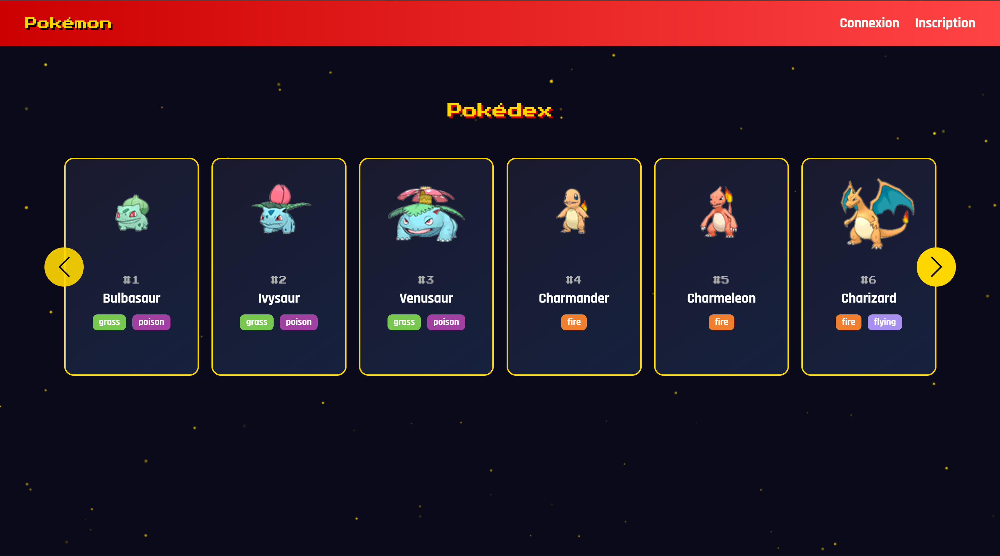
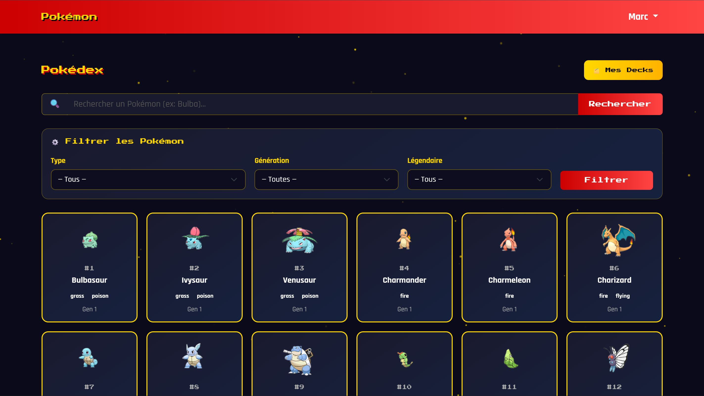
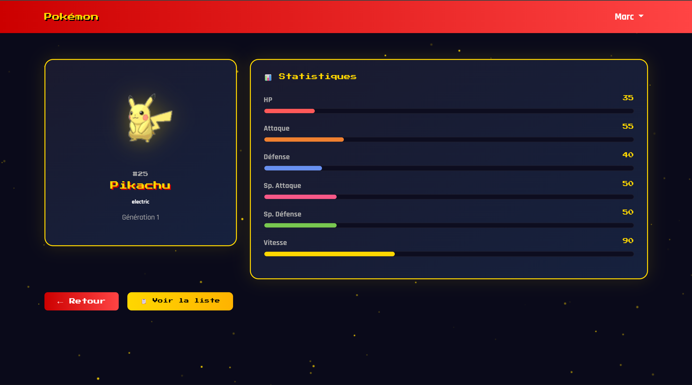
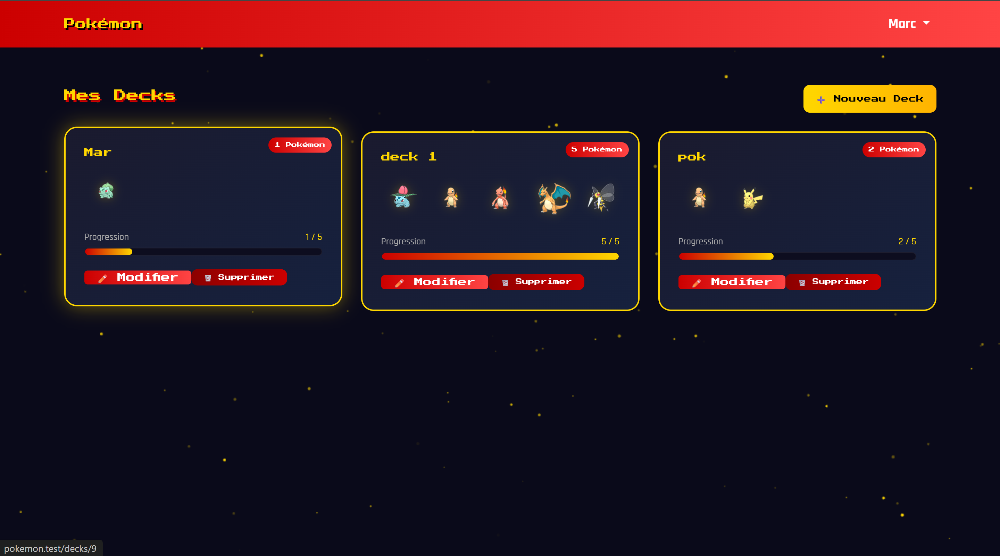
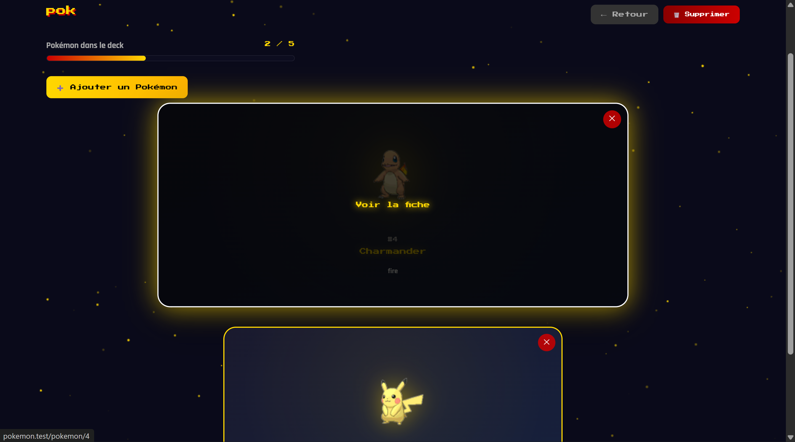
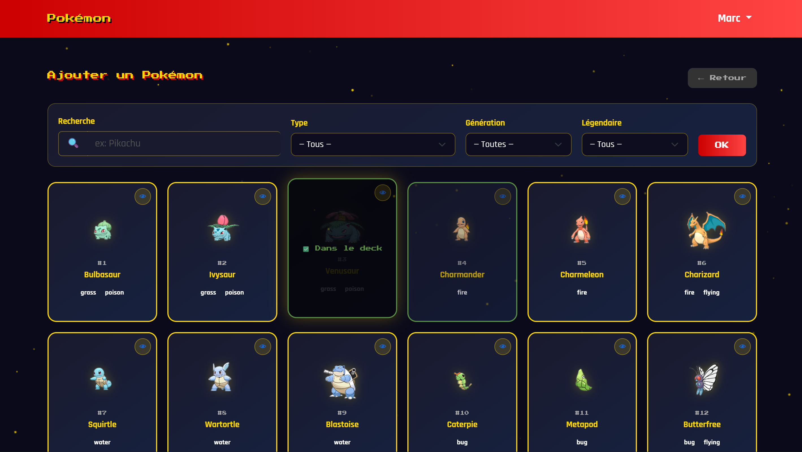
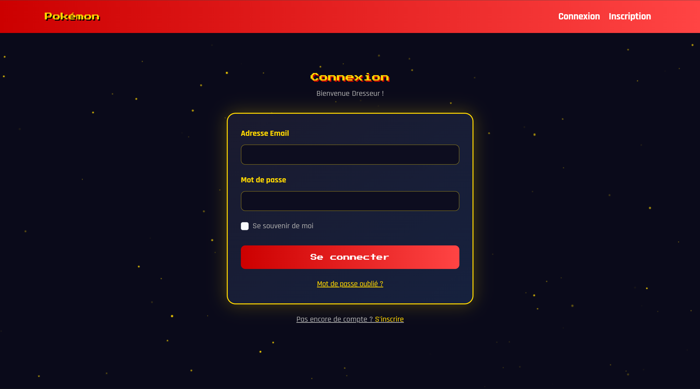

# 🎮 Pokémon Deck Builder

> Application web de gestion de decks Pokémon, réalisée avec Laravel 12.

---

## 📸 Aperçu

### Page d'accueil



### Pokédex (connecté)



### Fiche Pokémon



### Mes Decks



### Contenu d'un Deck



### Ajouter un Pokémon



### Connexion



---

## 🎯 Objectifs du projet

Développer une application permettant de :

- Lister et explorer tous les Pokémon du Pokédex
- Filtrer les Pokémon par type, génération et statut légendaire
- Consulter la fiche détaillée d'un Pokémon (stats, types, génération)
- Créer et gérer plusieurs decks de Pokémon
- Ajouter, modifier et supprimer des Pokémon dans un deck
- Sécuriser les decks par utilisateur (chaque deck est privé)

---

## ⚙️ Stack technique

Technologie

Version

PHP

8.4.0

Laravel

12.49.0

Node.js

20.19.5

Bootstrap

5.3

Base de données

SQLite

Build tool

Vite

---

## 🚀 Installation

### 1. Cloner le projet

```bash
git clone <url-du-repo>
cd projet-pokemon

```

### 2. Installer les dépendances PHP

```bash
composer install

```

### 3. Installer les dépendances JS

```bash
npm install

```

### 4. Configurer l'environnement

```bash
cp .env.example .env
php artisan key:generate

```

> `cp .env.example .env` copie le fichier de configuration modèle pour créer ton propre `.env`. Le fichier `.env.example` est déjà configuré avec SQLite, aucune modification nécessaire.
>
> `php artisan key:generate` génère une clé secrète unique utilisée par Laravel pour chiffrer les sessions et les cookies.

### 5. Créer la base de données SQLite

```bash
touch database/database.sqlite

```

> ⚠️ Le fichier `database.sqlite` n'est jamais versionné sur Git. Il faut le créer manuellement à chaque fois que tu clones le projet.

### 6. Lancer les migrations et les seeders

```bash
php artisan migrate:fresh --seed

```

Cette commande va :

- Créer toutes les tables
- Créer un utilisateur de test
- Importer tous les Pokémon depuis `database/seeders/data/pokemon.json`

### 7. Compiler les assets

```bash
npm run dev

```

### 8. Lancer le serveur

```bash
php artisan serve

```

L'application est accessible sur `http://localhost:8000`

---

## 👤 Compte de test

Champ

Valeur

Email

test@example.com

Mot de passe

password

---

## 📁 Structure des vues

```
resources/views/
├── auth/
│   ├── login.blade.php          # Connexion
│   ├── register.blade.php       # Inscription
│   ├── verify.blade.php         # Vérification email
│   └── passwords/
│       ├── email.blade.php      # Mot de passe oublié
│       └── reset.blade.php      # Réinitialisation
├── decks/
│   ├── index.blade.php          # Liste des decks
│   ├── create.blade.php         # Créer un deck
│   ├── show.blade.php           # Détail d'un deck
│   ├── edit.blade.php           # Modifier un deck
│   └── pokemons/
│       └── add.blade.php        # Ajouter un Pokémon au deck
├── pokemon/
│   ├── show.blade.php           # Grille Pokémon (home)
│   ├── detail.blade.php         # Fiche détail d'un Pokémon
│   ├── search.blade.php         # Barre de recherche
│   └── filter.blade.php         # Formulaire de filtres
├── layouts/
│   └── app.blade.php            # Layout principal
├── home.blade.php               # Page home connectée
├── homepokemons.blade.php       # Page d'accueil publique
└── welcome.blade.php            # Layout d'accueil

```

---

## 🗂️ Fonctionnalités

### 🔓 Accès public

- Voir le carousel de tous les Pokémon sur la page d'accueil
- Créer un compte / Se connecter

### 🔐 Accès connecté

- Explorer le Pokédex complet en grille
- Rechercher un Pokémon par nom
- Filtrer par type, génération et statut légendaire
- Voir la fiche détaillée d'un Pokémon (stats avec barres de progression)
- Créer, renommer et supprimer des decks
- Ajouter jusqu'à **5 Pokémon distincts** par deck
- Retirer un Pokémon d'un deck
- Voir la composition de ses decks (privé par utilisateur)

---

## 🎨 Design

L'interface adopte un thème **gaming Pokémon** avec :

- Police **Press Start 2P** pour les titres et éléments clés
- Police **Rajdhani** pour le texte courant
- Palette de couleurs : rouge Pokédex, jaune or, fond sombre
- Fond animé avec étoiles scintillantes (canvas JS)
- Cartes Pokémon avec effets hover et animations flottantes
- Badges de types colorés par catégorie (feu, eau, plante...)
- Barres de stats colorées par statistique

---

## 📊 Base de données

Les Pokémon sont alimentés via des **seeders** à partir d'un fichier JSON (`database/seeders/data/pokemon.json`) issu de données Kaggle, contenant :

- Numéro Pokédex, nom, types
- Statistiques (HP, Attaque, Défense, Sp. Attaque, Sp. Défense, Vitesse)
- Génération, statut légendaire, chemin de l'image

---

## 🔒 Sécurité

- Authentification via Laravel Auth
- Chaque deck est lié à un utilisateur (`user_id`)
- Vérification `abort_if` sur chaque action de deck pour s'assurer que l'utilisateur est bien le propriétaire

---

## ⚠️ Points importants après clonage

Fichier

Statut

Action requise

`.env`

Non versionné

`cp .env.example .env`

`database/database.sqlite`

Non versionné

`touch database/database.sqlite`

`APP_KEY`

Non versionné

`php artisan key:generate`

`public/build`

Non versionné

`npm install && npm run dev`

---

## 👤 Auteur

Projet réalisé dans le cadre du cours Laravel — MyDigitalSchool 2025/2026.
